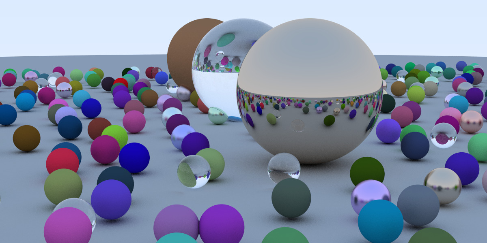

# Ray Tracing In One Weekend
_in CUDA!_ book by Peter Shirley

I read through the book of https://raytracing.github.io/books/RayTracingInOneWeekend.html
and implemented it in plain C++ code. In addition to that, I also read through Roger Allen from Nvidia's https://developer.nvidia.com/blog/accelerated-ray-tracing-cuda/. Using that as a reference I decided to build up on it.

My version of ray tracing in one weekend is a hybrid between the solution, but also is slightly more efficient. Given that the code done by Roger Allen didn't distribute across the z-dimension and instead used a for loop in the render method, I improved upon his solution. I also added a realtime renderer using SDL and camera controls but because the scene is too complex I turned it off by default.